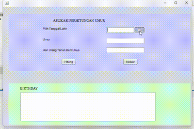

# Aplikasi Penghitung Umur

Aplikasi Penghitung Umur adalah aplikasi berbasis Java yang membantu pengguna menghitung usia secara terperinci. Aplikasi ini juga menampilkan tanggal ulang tahun berikutnya, lengkap dengan hari dalam Bahasa Indonesia, serta memberikan informasi tentang peristiwa penting yang pernah terjadi pada tanggal tersebut.

## Keunggulan Aplikasi

- **Penghitungan Umur**: Menghitung usia pengguna dari tanggal lahir yang dimasukkan.
- **Tanggal Ulang Tahun Berikutnya**: Menampilkan tanggal ulang tahun berikutnya beserta hari dalam Bahasa Indonesia.
- **Informasi Peristiwa Bersejarah**: Menyajikan informasi tentang peristiwa penting yang pernah terjadi pada tanggal ulang tahun pengguna, berdasarkan data yang diambil secara daring.

## Pembuat Aplikasi

Salsa Alya Istiqamh - 2210010089 - Latihan 2

## Fitur

Aplikasi Penghitung Umur menawarkan fitur-fitur berikut:

1. **Penghitungan Umur Rinci**  
   Menghitung usia pengguna secara lengkap, mencakup jumlah tahun, bulan, dan hari berdasarkan tanggal lahir yang dimasukkan.

2. **Penentuan Tanggal Ulang Tahun Berikutnya**  
   Menampilkan tanggal ulang tahun berikutnya, termasuk harinya dalam bahasa Indonesia, agar pengguna tahu kapan mereka akan berulang tahun selanjutnya.

3. **Peristiwa Penting pada Tanggal Ulang Tahun Berikutnya**  
   Memberikan informasi historis mengenai peristiwa penting yang terjadi pada tanggal ulang tahun pengguna dari sumber API eksternal. Ini memberikan wawasan unik tentang kejadian bersejarah yang relevan.

4. **Antarmuka Pengguna Sederhana dan Intuitif**  
   Dibangun dengan Java Swing, aplikasi ini menyajikan antarmuka yang mudah digunakan untuk memasukkan tanggal lahir dan memulai penghitungan.

5. **Pembatalan Pengambilan Data Secara Asinkron**  
   Pengguna dapat membatalkan permintaan pengambilan data peristiwa penting jika perlu, menjaga fleksibilitas aplikasi.

6. **Dukungan Format Tanggal Kustom**  
   Tanggal ulang tahun berikutnya ditampilkan dalam format (dd-MM-yyyy), sesuai dengan standar yang mudah dipahami di Indonesia.

## Cara Menjalankan

1. Clone repositori ini ke komputer Anda atau unduh sebagai file ZIP.
2. Buka proyek di IDE pilihan Anda (misalnya, IntelliJ atau Eclipse).
3. Pastikan JDK sudah terkonfigurasi dengan benar di IDE Anda.
4. Jalankan `PenghitungUmurFrame` untuk memulai aplikasi.

## Demo

